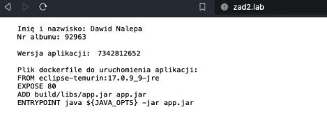
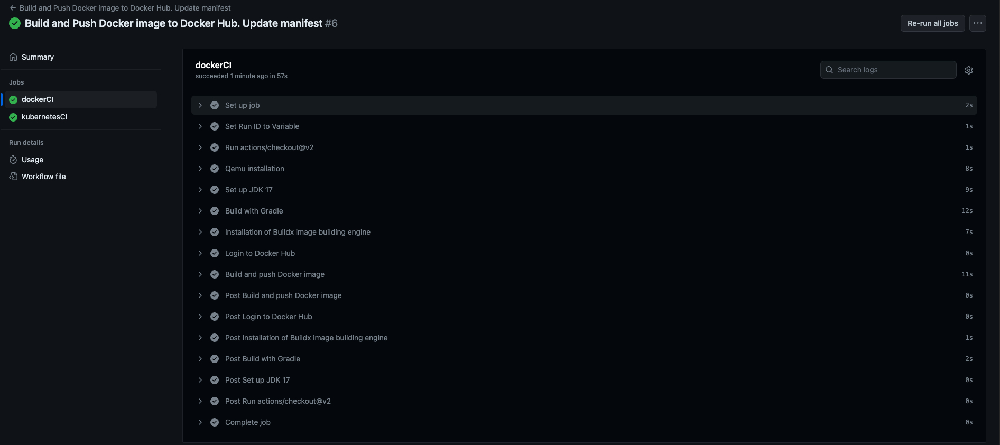
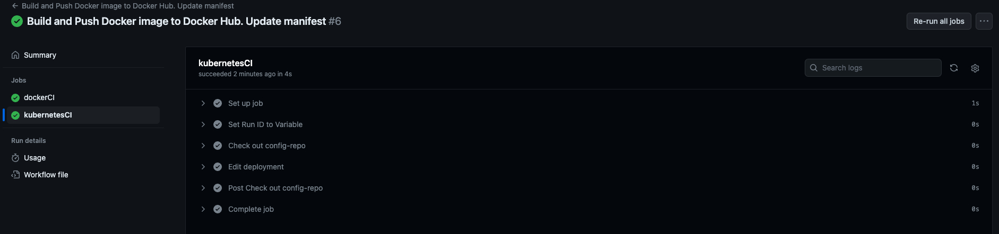

# Source-repo

## Zadanie obowiązkowe nr 2 - Laboratorium 10

### Opis aplikacji

Aplikacja wyświetla dane:

```HTML
    Imię i nazwisko: Dawid Nalepa
    Nr albumu: 92963

    Wersja aplikacji: <p th:text="${appVersion}"/>

    Plik dockerfile do uruchomienia aplikacji:
    FROM eclipse-temurin:17.0.9_9-jre
    EXPOSE 80
    ADD build/libs/app.jar app.jar
    ENTRYPOINT java ${JAVA_OPTS} -jar app.jar
```

Gdzie:

```HTML
Wersja aplikacji: <p th:text="${appVersion}"/>
```

odczytuje wersję aplikacji ze zmiennej środowiskowej zawartej w pliku **application.properties**, która aktualizuje się wraz z odpaleniem/aktualizacują deploymentu (zostało to zdefiniowane w pliku **deployment.yaml** w sekcji **env** w repozytorium **Config-repo**).

#### Potwierdzenie działania aplikacji



Zawartość pliku **application.properties**:

```JAVA
APP_VERSION = ${VERSION}
server.port=80
```

### Zawartość pliku zad2lab10.yaml

```yaml
name: Build and Push Docker image to Docker Hub. Update manifest

on: workflow_dispatch

jobs:
  dockerCI:
    name: dockerCI
    runs-on: ubuntu-latest
    steps:
      - name: Set Run ID to Variable
        run: echo "NEW_VERSION=${{ github.run_id }}" >> $GITHUB_ENV

      - uses: actions/checkout@v2

      - name: Qemu installation
        uses: docker/setup-qemu-action@v3

      - name: Set up JDK 17
        uses: actions/setup-java@v2
        with:
          java-version: 17
          distribution: "adopt"

      - name: Build with Gradle
        uses: gradle/gradle-build-action@v2
        with:
          arguments: build

      - name: Installation of Buildx image building engine
        uses: docker/setup-buildx-action@v3

      - name: Login to Docker Hub
        uses: docker/login-action@v2
        with:
          username: ${{ secrets.DOCKERHUB_USERNAME }}
          password: ${{ secrets.DOCKERHUB_TOKEN }}

      - name: Build and push Docker image
        uses: docker/build-push-action@v4
        with:
          context: ./
          push: true
          tags: xstck/app-image:${{ env.NEW_VERSION }}
          platforms: linux/amd64,linux/arm64

  kubernetesCI:
    name: kubernetesCI
    runs-on: ubuntu-latest
    needs: dockerCI
    steps:
      - name: Set Run ID to Variable
        run: echo "NEW_VERSION=${{ github.run_id }}" >> $GITHUB_ENV
      - name: Check out config-repo
        uses: actions/checkout@master
        with:
          repository: xStck/Config-repo
          token: ${{ secrets.PAT_GITHUB }}

      - name: Edit deployment
        run: |
          git config --global user.name "ci"
          git config --global user.email "ci@ci.ci"
          yq -i '.spec.template.spec.containers[0].image |= "xstck/app-image:" + strenv(NEW_VERSION)' deployment.yaml
          yq -i '.spec.template.spec.containers[0].env[0].value = strenv(NEW_VERSION)' deployment.yaml
          git add deployment.yaml
          git commit -m "update deployment.yaml"
          git push origin main
```

#### Potwierdzenie działania job-a dockerCI



#### Potwierdzenie działania job-a kubernetesCI


